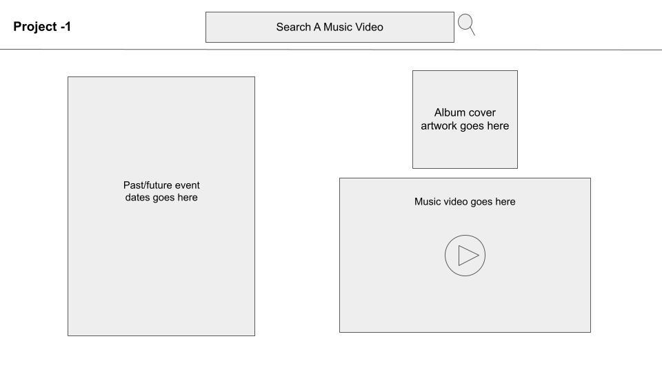

# Project-1

Brynne's wireframe main page.

After searched dynamically display template below

If able:
- Add more songs dynamically create under the main content.
- Change cursor to a tune symbol or music note.

API's:
- https://www.songkick.com/developer/upcoming-events-for-artist
- https://www.theaudiodb.com/api_guide.php
- https://musicbrainz.org/doc/MusicBrainz_API

Rules for the API's:
- songkick:
    - https://www.songkick.com/developer/api-terms-of-use
    - Attribution: you must display one of the logos provided by Songkick here on your application and wherever Songkick Data is used.

    - When using the Songkick API, you must provide a link to the Songkick event page (example) for each event.

    - Songkick will be the exclusive live music data provider. Please do not combine our data with any other concert data provider.

    - You may only make calls to the Songkick API at a reasonable rate.

    - You may not retain any copies of the Songkick Data, except for the purposes of retaining cached information for short periods (i.e. hours, not days).

    - For Non-commercial: you must notify us if you want to start using the data for Commercial use, we reserve the right to revoke access if this is not complied with.
    
    - For Commercial: we have the right to revoke access if your use of the data competes with products or services offered by Songkick. For example, Songkick's core products today are personalized concert calendars and concert calendar alerts for the web, iPhone, Android, and Spotify.

- musicbrainz
    - I agree to use the Live Data Feed for non-commercial (less than $500 income per year) or personal uses only. I also agree to treat my access token as a secret and will not share this token publicly or commit it to a source code repository.